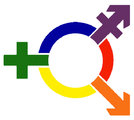

##Getting Started

Go to the [Beginner Project](https://github.com/CreatingChange/Beginner) and click on the "Download ZIP" button in the right hand column. Navigate to where your computer has downloaded this file.

Double click on the downloaded "Beginner-master" Zip file so that it will unzip, then move that folder into a location where you want to store your project. I have a folder I call "Code". You also may want to rename the "Beginner-master" folder to reflect the name of the website you're working on today.

Next we need a program to edit text. Download [Sublime](www.sublimetext.com) and open it. There are many text editors available; this is just one that we like.

Run Sublime, select the "open" menu option, select your project folder ("Beginner-master" or whatever you renamed it), and select "open". You should see the Beginner-master folder, which includes several folders and files.

Continue by [downloading JQuery](http://jquery.com/download/) and choose the uncompressed, development version, 1.11.2. This should download to the same place the project did.

Create a few folder inside your project folder called `js` and put your newly downloaded JQuery file in that folder. While you're there, create a new, empty file called `scripts.js`. This is where all of your Javascript and JQuery will go.

Finally, open index.html in your browser and check out the simple website that the Beginner group is creating. We will be taking it to the next level by adding interactivity.

##What is Javascript?
Javascript is a programming language that's built-in to web browsers. It enables a user to interact with a website (and vice versa). In Javascript, you can do all kinds of basic programming logic, like loops and if statements. While incredibly fun and interesting, that kind of programming logic is a bit harder to find a practical use for when building a simple website. That's why today we'll be focusing on the interactive potential of Javascript using JQuery, a Javascript library that makes it easier to use. If you want to learn more about Javascript as a programming language, there are many online resources available, including [Code Academy](http://www.codecademy.com/en/tracks/javascript).

The first thing we're going to do is prepare our scripts.js file. We need to tell it to run our Javascript code only after the HTML has been read and the page is ready to be manipulated by user interaction. So all of the Javascript we'll be writing in this lesson will be within this function in scripts.js.

```javascript
$(document).ready(function() {

});
```

If you'd like to learn more about why we need this, [JQuery has documentation](http://learn.jquery.com/using-jquery-core/document-ready/) that tells us that the function will be run when the [Document Object Model](https://developer.mozilla.org/en-US/docs/Web/API/Document_Object_Model/Introduction) is ready.

##Writing Code

Open your `index.html` file in Sublime and put the following HTML right inside `<head>` tags.

```html
<script src="js/jquery-1.11.2.js"></script>
<script src="js/scripts.js"></script>
```

These tell our HTML where to find the javascript resources we're going to provide both from our code and JQuery. It's important that our own `scripts.js` file goes after jQuery, as it will rely on jQuery functionality that must be loaded first.

Now open your `scripts.js` file in Sublime as well.

Let's use some JQuery to interact with an image element on our page. Elements like `` tags can have attributes assigned to them through class and id values. These let us locate a specific element and use Javascript and JQuery to interact with them. In index.html, note that all 6 of the images hava a class of "image_1". We can then reference that class when we're writing our Javascript code.

Inside your `scripts.js` file now add this bit within the document ready function:

```javascript
$(document).ready(function() {
    $(".image_1").click(function() {

    });
});
```

If we break this down there are several parts to even this small bit of code. `$(".image_1")` means that using JQuery we're going to look for an interaction with any page element with a class of "image_1". The `$` is simply a much shorter way of saying `jQuery` which you'll be seeing a lot in this lesson.

When locating or styling elements a period is used for classes and a pound sign (hash) is used for ids. Classes can be used over and over again on many different elements in one page. Ids are expected to be unique.

The next section, the `.click(function()` section says what specific action to listen for. In this case we're looking for the cursor to click on an element but many different options exist including:

<ul>
    <li>.hover()</li>
    <li>.dblclick()</li>
    <li>.show()</li>
    <li>.focus()</li>
    <li>.keypress()</li>
</ul>

I bet you already have some idea what a lot of those do!

The empty line between the `{` and the `}` is where we'll be placing the code that tells our site *what* to do when it "hears" the even happen. These collectively are called *Event Listeners* or *Event Handlers*.

When a user clicks on one of the 6 images, we're going to make the top row of images disappear. In order to do that, let's assign just the top row of images on the page to a class called "hide_this".

```html
<div class="row">
    <div class="hide_this">
        
        
    </div>
</div>
```

Now that we have the "hide_this" class we can use, let's add an event listener.

```javascript
$(".image_1").click(function() {
    $(".hide_this").hide();
});
```

Check it out in the browser!

##Complete the Functionality

Now let's create some content that we want to appear when we click the top left hand image. Go back to your `index.html` file and place everything inside of the `<div id=click_image>` and `</div>` tags where you see it in the code snippet below.

```html
<div class="col-md-6">
    <div class="row">
        <div class="hide_this">
            
            
        </div>
        <div id="click_image">
            
            
        </div>
    </div>
```

Now let's update scripts.js to include a bit about showing the replacement row of images.

```javascript
$(".image_1").click(function() {
    $(".hide_this").hide();
    $("#click_image").show();
});
```

Remember that the hash is used in front of "click_image" because "click_image" is an ID, not a class. With your partner, see if you can talk through step-by-step what's going on when the page loads and an image is clicked on.

##More JQuery Functions

You might have noticed by now that, while you can click to make the hidden image replace the original, clicking again will not swap them back. This is a relatively simple matter of reversing our JQuery. We have all the infrastructure we need in the tags, classes, and ids that we need in our HTML already. Place this `.click()` in its place on the `scripts.js` page immediately following the previous code you wrote, but still wrapped within the document ready function.

```javascript
$("#click_image").click(function() {
    $(".hide_this").show();
    $("#click_image").hide();
});
```
This should be all that's required to impliment the "return click" functionality that was previously lacking. Now when a user clicks an image, the replacement top row will appear. If they click the top row of images again, it will go back to the original images.


##Adjust the Font Size on the Fly

Let's examine an example of how you might use this new knowledge to increase user access. It's not uncommon for web designers to spend very little time thinking about the design choices they've made and how that might impact users of different ability levels. One very basic example might be using an extrordinarily small font size. We can add the ability to adjust the font size on the fly with JQuery.

First, let's physically add the buttons to our navbar. Find the section of the HTML just below:

```html
    <ul class="nav navbar-nav">
      <li class="active"><a href="index.html">Home</a></li>
      <li><a href="about.html">About</a></li>
      <li><a href="contact.html">Contact</a></li>
      </ul>
</div>
```
Once you've found it, add this bit of HTML.

```html
<div class="navbar-right font-size">
    <p class="navbar-text">Adjust Font Size</p>
    <button type="button" class="btn btn-default navbar-btn">-</button>
    <button type="button" class="btn btn-default navbar-btn">+</button>
</div>
```
What we're doing here is adding two buttons to increase and decrease font size respectively. They don't function yet, that's what the JQuery will be doing. We've wrapped both these buttons in a separate `<div>` tag so that we can push them to the right inside the navbar as a whole. `class="navbar-right"` is something bootstrap gives us. `font-size` is a class we've added on our own to hook the JQuery into in a moment.

###Button Styling

The `<p>` tag right after the above `<div>` is simply a label for our buttons so users know what they're for. Once again, the class that's attached is simply a preexisting bootstrap class that ensures our text is styled consistently with the rest of the navbar.

If you look at the live version of your page at the moment, you'll see that your second button is hugged right up against the far right side of the navabar. Let's fix that quickly. Go into your `styles.css` file and add the code below:

```css
.font-size {
    margin-right: 10px;
}
```

###Button Functionality

Now let's add some actual JQuery functionality to our buttons. Like before, we'll need to grab onto some sort of class or id and then add the functionality.

```javascript
$(".font-size").click(function() {
    $(".container").css("font-size", function() {
        return parseInt($(this).css('font-size')) + 1 + 'px';
    });
});
```

That gets a bit more complicated than before, so let's take a look. The line with the `.click` function works exactly as before. It's looking for a click activation on something with the class `font-size` and then executing the code that follows.

The next line uses the `.css()` function which, like `.show()` and `.hide()` allow us to alter something; in this case the value of a css selector. We're telling it to alter the `font-size` selector that we had previously added to `styles.css`.

At this point, I need help explaining "this" to new coders! Help!

Now if you reload your page you'll see that our "plus" button will increase the font size on the entire page! The problem you'll run into if you poke around for a minute is that the "minus" button doesn't work. It increases font size too! So let's make some changes.

###Button Differentiation

Go ahead and change the `font-size` classes on your buttons to what you see below.

```html
<button type="button" class="btn btn-default navbar-btn font-size-down">-</button>
<button type="button" class="btn btn-default navbar-btn font-size-up">+</button>
```
Because we need each button to do something different, we'll need a different bit of JQuery for each button. Edit your most recent JQuery code in the `scripts.js` file to hook onto `.font-size-up` instead of `.font-size`. Now copy that code and paste it right before the final closing brace in `scripts.js`. We'll need to change just a couple of things.

```javascript
$(".font-size-down").click(function() {
    $(".container").css("font-size", function() {
        return parseInt($(this).css('font-size')) - 1 + 'px';
    });
});
```
You'll notice that this bit hooks into the `.font-size-down` class that you added just a few minutes ago to the `index.html` file. Finally, the line that returns the changed number of pixels for the font size needs to now subtract one pixel instead of add one so that our button will decrease the page's font size.


